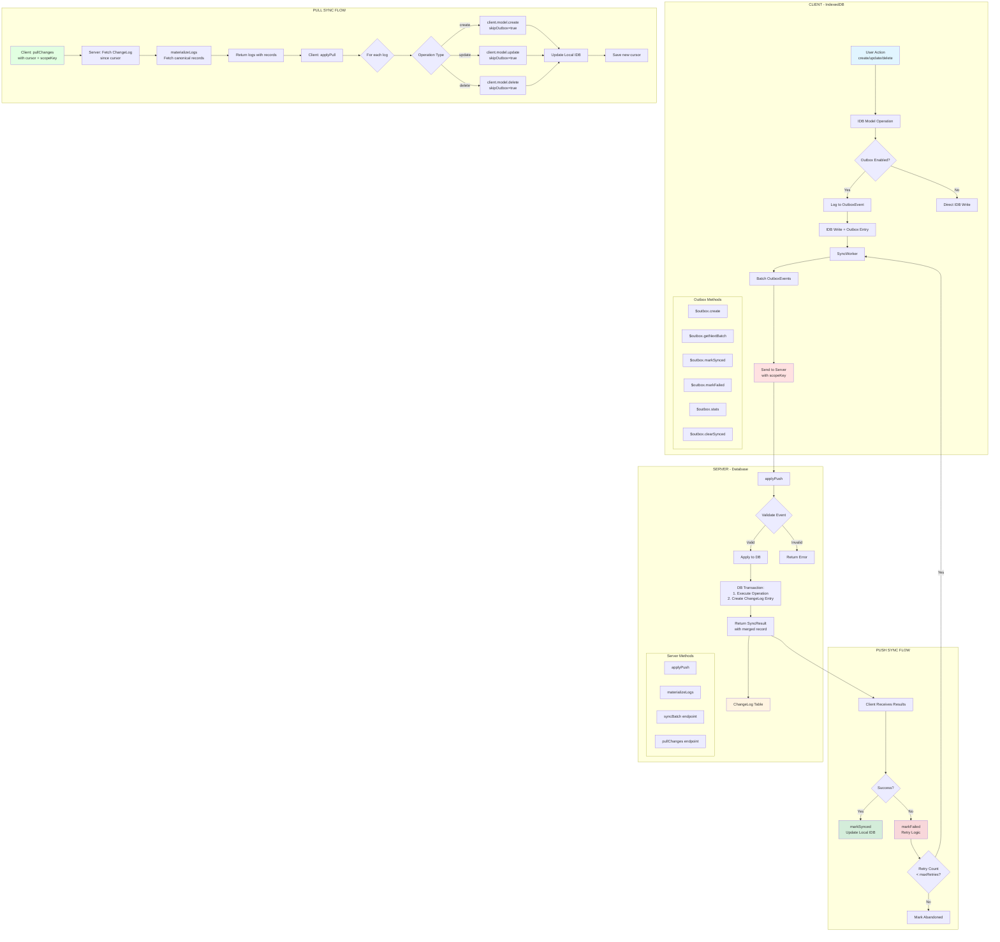
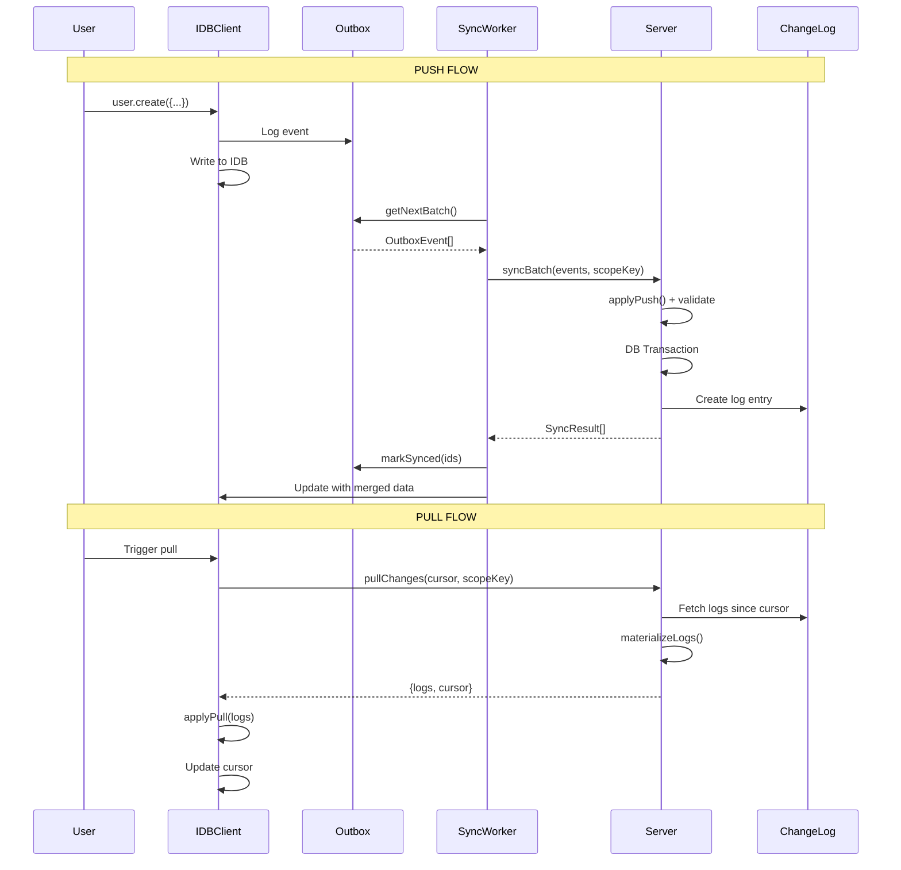

# Prisma IndexedDB Client Generator

This library is a **Prisma generator** that creates a client with a similar syntax and behavior to the Prisma Client but is designed to operate with **IndexedDB** for local storage. It allows developers to interact with IndexedDB using a familiar Prisma-like API.

## ⚠️ Warning

This library is not fully ready yet. Check [issue #52](https://github.com/prisma-idb/idb-client-generator/issues/52) for the current list of implemented features.

## Features

- Prisma-like syntax and API for IndexedDB.
- Supports CRUD operations with structured data.
- Integrates seamlessly with Prisma workflows.
- Generates a client tailored to your Prisma schema.
- Real-time sync between local IndexedDB and remote server with conflict resolution.

## Architecture

### Sync Flow Overview

This library implements a bidirectional sync system between local IndexedDB storage and a remote server database. The architecture uses an outbox pattern for reliable push operations and a changelog-based system for pull operations.



### Key Components

#### Push Flow (Client → Server)

1. **Local Mutation**: User performs CRUD operations via the generated IDB client
2. **Outbox Pattern**: Operations are logged to the `OutboxEvent` store with:
   - `entityType`: Model name (e.g., "User", "Todo")
   - `operation`: "create" | "update" | "delete"
   - `payload`: Full record data
   - `scopeKey`: Used for multi-tenant or user-scoped data

3. **SyncWorker**: Background process that:
   - Fetches batches via `$outbox.getNextBatch()`
   - Sends events to server via `syncHandler`
   - Implements retry logic with exponential backoff
   - Marks events as synced or failed

4. **Server Processing**: `applyPush()` function:
   - Validates events against Zod schemas
   - Executes DB operations in transactions
   - Creates ChangeLog entries for each change
   - Returns `SyncResult[]` with merged records

5. **Result Handling**:
   - Success: `$outbox.markSynced()` removes from queue, updates local IDB with server data
   - Failure: `$outbox.markFailed()` increments retry count
   - Abandoned: Events exceeding `maxRetries` are marked as failed

#### Pull Flow (Server → Client)

1. **Client Request**: Calls `pullChanges()` with:
   - `since`: Cursor (ChangeLog ID) from last sync
   - `scopeKey`: Filter for user/tenant-specific changes

2. **Server Processing**:
   - Fetches ChangeLog entries since cursor
   - `materializeLogs()`: Retrieves current canonical records from DB
   - Returns logs with full record data

3. **Client Application**: `applyPull()` function:
   - Iterates through logs
   - Applies operations via `handlerMap` (bypassing outbox with `skipOutbox=true`)
   - Updates local IndexedDB with server state
   - Saves new cursor for next pull

#### Helper Methods

**Client Side:**
- `PrismaIDBClient.createSyncWorker()`: Create background sync worker
- `$outbox.create()`: Log new outbox event
- `$outbox.getNextBatch()`: Fetch unsynced events
- `$outbox.markSynced()`: Mark events as successfully synced
- `$outbox.markFailed()`: Record sync failure
- `$outbox.stats()`: Get sync statistics
- `$outbox.clearSynced()`: Clean up old synced events
- `applyPull()`: Apply remote changes to local IDB

**Server Side:**
- `applyPush()`: Process and apply client events
- `materializeLogs()`: Fetch canonical records for changelog entries
- `syncBatch()`: Endpoint for receiving client batches
- `pullChanges()`: Endpoint for serving changelog updates

### Data Flow Summary



## Installation

```bash
pnpm add @prisma-idb/idb-client-generator
```

## Development Setup

This project uses pnpm workspaces and includes a devcontainer configuration for a consistent development environment.

### Using DevContainer (Recommended)

1. Open the project in VS Code
2. Install the "Dev Containers" extension if you haven't already
3. Click "Reopen in Container" when prompted, or use the command palette: `Dev Containers: Reopen in Container`
4. The container will automatically install dependencies using pnpm

### Local Development

If you prefer to develop locally:

1. Install pnpm: `corepack enable` (Node.js 16.13+) or `npm install -g pnpm`
2. Install dependencies: `pnpm install`
3. Run development server: `pnpm dev`
4. Run tests: `pnpm test`

## Usage

### 1. Add to Prisma Schema

Update your `prisma.schema` file to include the generator:

```prisma
datasource db {
  provider = "postgresql"
  url      = env("DATABASE_URL")
}

generator client {
  provider = "prisma-client-js"
}

generator prismaIDB {
  provider = "idb-client-generator"
  output   = "./prisma-idb"
}

model User {
  id    Int    @id @default(autoincrement())
  name  String
  email String @unique
}
```

### 2. Generate the Client

Run the Prisma client generation command:

```bash
pnpm exec prisma generate
```

This will generate a client in your project.

### 3. Use the Client

Import the generated client and use it in your code:

```typescript
import { PrismaIDBClient } from "./outputPath/prisma-idb-client";

async function main() {
  const idbClient = await PrismaIDBClient.createClient();

  await idbClient.user.create({
    data: { name: "Alice", email: "alice@example.com" },
  });

  const users = await idbClient.user.findMany();
  console.log(users);
}
```

## API

The API mimics Prisma Client's API for ease of use:

### `create`

Insert a new record:

```javascript
idbClient.modelName.create({
  data: {
    field: value,
  },
});
```

### `findMany`

Retrieve all records:

```javascript
idbClient.modelName.findMany();
```

### `findUnique`

Retrieve a single record by unique key:

```javascript
idbClient.modelName.findUnique({
  where: { key: value },
});
```

### `update`

Update a record:

```javascript
idbClient.modelName.update({
  where: { key: value },
  data: { key: newValue },
});
```

### `delete`

Delete a record:

```javascript
idbClient.modelName.delete({
  where: { key: value },
});
```

## Development Notes

- **IndexedDB Dependency**: The client internally uses the `idb` library for IndexedDB operations.
- **Compatibility**: Ensure your environment supports IndexedDB (modern browsers).
- **Local-Only**: This is designed for local storage scenarios and does not support server-side databases.

## Contributing
We welcome contributions! Please see our CONTRIBUTING.md for guidelines on how to contribute to this project.

## Security
If you discover a security vulnerability, please follow our SECURITY.md guidelines on reporting issues responsibly.

## License
This project is licensed under the GNU Affero General Public License v3.0. See the LICENSE file for more details.

## Acknowledgements
Special thanks to the open-source community for their contributions to the tools and libraries used in this project.
