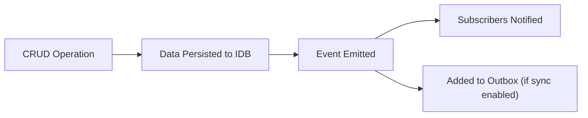

Prisma IDB provides an event system to notify your app when data changes, enabling reactive UI updates and automatic synchronization.

## Events

Only **mutation operations** emit events:

- `create` - Record inserted
- `update` - Record modified
- `delete` - Record removed

**Read operations** (`findMany`, `findUnique`, `count`, etc.) do **not** emit events.

Each event contains:

- **Event type**: `create`, `update`, or `delete`
- **Record data**: The changed record
- **Operation context**: Key path, old data (for updates), metadata

<Callout type="info">
  Events are emitted **after** the operation completes and the data is persisted to IndexedDB.
</Callout>

### Event Lifecycle



## Subscribe

Listen for changes on a specific model:

```typescript
// Subscribe to all events on a model
client.user.subscribe(["create", "update", "delete"], (event) => {
  console.log("Change detected:", event.detail);
});
```

Subscribe returns an `unsubscribe` function:

```typescript
const unsubscribe = client.user.subscribe(["create"], (event) => {
  console.log("User created:", event.detail);
});

// Later, stop listening
unsubscribe();
```

### Selective Subscription

Listen to specific event types:

```typescript
// Only create events
client.todo.subscribe(["create"], (event) => {
  console.log("New todo:", event.detail);
});

// Only updates
client.todo.subscribe(["update"], (event) => {
  console.log("Todo changed:", event.detail);
});

// Create and delete, but not update
client.user.subscribe(["create", "delete"], (event) => {
  console.log("User lifecycle change:", event.detail);
});
```

### Event Handler Pattern

Use async handlers to respond to changes:

```typescript
client.user.subscribe(["create", "update"], async (event) => {
  const user = event.detail;

  // Validate
  if (!user.email) {
    console.warn("Invalid user event");
    return;
  }

  // Sync to external service
  try {
    await api.users.upsert(user);
  } catch (error) {
    console.error("Sync failed:", error);
  }
});
```

## Silent Operations

Prevent events from firing with the `silent` option:

```typescript
// This operation won't emit an event
await client.user.create(
  {
    data: { name: "Alice" },
  },
  {
    silent: true, // Skip event emission
  }
);
```

Use cases:

- Bulk operations without notification overhead
- Loading initial data from server
- Avoiding infinite loops with bidirectional sync

### Default Behavior

By default, all operations emit events (equivalent to `silent: false`). If you're using bidirectional sync, set `silent: false` to ensure the outbox captures the change.

## Outbox Integration

When sync is enabled, mutations are automatically captured for server synchronization via the outbox pattern.

### Controlling Outbox Capture

```typescript
// Add to outbox (default with sync enabled)
await client.user.create({ data: { name: "Alice" } }, { addToOutbox: true });

// Skip outbox capture
await client.user.create({ data: { name: "Alice" } }, { addToOutbox: false });
```

### Silent + Outbox

Use both flags together to load data without triggering events or outbox capture:

```typescript
// Load data from server without affecting local state notifications or sync
await client.user.create(
  { data: { name: "Alice" } },
  {
    silent: true,
    addToOutbox: false, // Loading from server, don't re-sync
  }
);
```

## Common Patterns

### Real-Time UI Updates

Subscribe in a SvelteKit component:

```svelte
<script lang="ts">
  import { onMount } from "svelte";
  import { PrismaIDBClient } from "$lib/prisma-idb";

  let todos = $state<Todo[]>([]);
  let client: PrismaIDBClient;

  onMount(async () => {
    client = await PrismaIDBClient.createClient();

    // Load initial data
    todos = await client.todo.findMany();

    // Subscribe to changes
    client.todo.subscribe(["create", "update", "delete"], async (event) => {
      // Refresh list
      todos = await client.todo.findMany();
    });
  });
</script>

{#each todos as todo (todo.id)}
  <div>{todo.title}</div>
{/each}
```

### Centralized Event Hub

Create a custom event bus:

```typescript
export class EventBus {
  private handlers = new Map<string, Set<Function>>();

  subscribe(event: string, handler: Function) {
    if (!this.handlers.has(event)) {
      this.handlers.set(event, new Set());
    }
    this.handlers.get(event)!.add(handler);

    return () => {
      this.handlers.get(event)!.delete(handler);
    };
  }

  emit(event: string, data: any) {
    this.handlers.get(event)?.forEach((handler) => handler(data));
  }
}

// Bridge Prisma IDB events to your event bus
const bus = new EventBus();

client.user.subscribe(["create"], (event) => {
  bus.emit("user:created", event.detail);
});

// Now other parts of your app can listen
bus.subscribe("user:created", (user) => {
  console.log("User created globally:", user);
});
```

### Offline Queue Indicator

Track pending sync operations:

```typescript
let pendingCount = $state(0);

client.user.subscribe(["create", "update", "delete"], async (event) => {
  const hasOutbox = client.outboxEvent !== undefined;

  if (hasOutbox) {
    const stats = await client.outboxEvent.count();
    pendingCount = stats.count;
  }
});
```

(See [Outbox Stats](../sync/outbox-stats) for more details on monitoring pending operations.)

## Type Safety

Event details are fully typed based on your Prisma schema:

```typescript
client.user.subscribe(["create"], (event) => {
  // event.detail has type User
  const user = event.detail;

  // Full TypeScript support
  console.log(user.email); // ✅ Valid
  console.log(user.unknown); // ❌ TypeScript error
});
```
