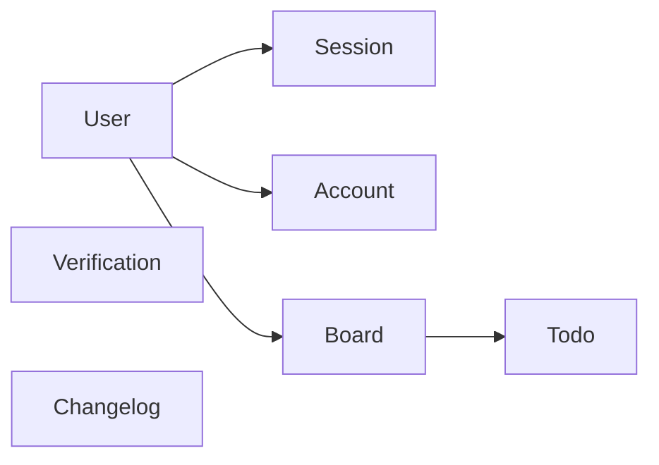
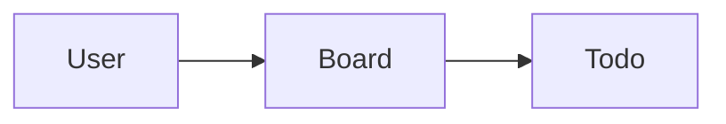
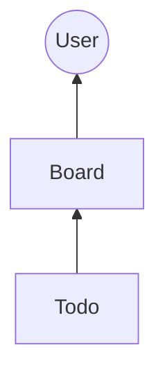

## Authoritative Schema DAG

The authoritative schema DAG (Directed Acyclic Graph) defines how local changes are scoped and applied, ensuring data consistency across clients and the server. This structure manages dependencies between models during synchronization.

### Scoping Schema

Typically in a local-first application, we don't need all the tables/models to be synchronized for every user. Instead, we scope the sync to only the relevant data for each user. This is achieved excluding/including specific models in the sync process based on user context.

For example, the `Session` model may not be synchronized for every user, as sessions are often user-specific and transient. By scoping the sync to only include models like `User`, `Post`, and `Comment`, in a blog application, we can optimize the synchronization process and reduce unnecessary data transfer.

#### Full schema

#### Scoped schema

Exclude `Session`, `Verification`, `Account`, and `Changelog` models from sync as they aren't relevant to the local intent of the user.

### Creating the DAG

Good news is, you as a developer, don't have to manually create and manage the DAG. You only need to specify the `rootModel` and the models to include in the sync process when initializing the sync engine. The sync engine will automatically construct the DAG based on the relationships defined in your Prisma schema.

For the above example, if `User` is the `rootModel`, and we include `Board` and `Todo` models, the sync engine will understand that `Board` depends on `User`, and `Todo` depends on `Board`, forming the necessary DAG for synchronization.

#### Schema requirements for the DAG

In order to effectively build and utilize the authoritative schema DAG, certain schema requirements must be met. These include defining clear relationships between models, ensuring that foreign keys are properly set up, adhering to the sync schema requirements outlined in the [previous section](./schema-requirements), and the following:

- **Root Model**: The `rootModel` must be clearly defined and should represent the primary entity from which other models derive their context.
- **Dependent Models**: All models that are included in the sync process must have a direct or indirect relationship with the `rootModel`.
- **Ownership Invariants**: Models should include ownership fields (e.g., `ownerId`) to enforce data access rules during synchronization.
- **No Cyclic Dependencies**: The relationships between models must not form cycles, as this would violate the acyclic nature of the DAG.
