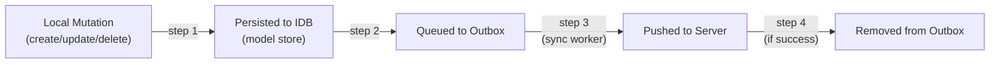
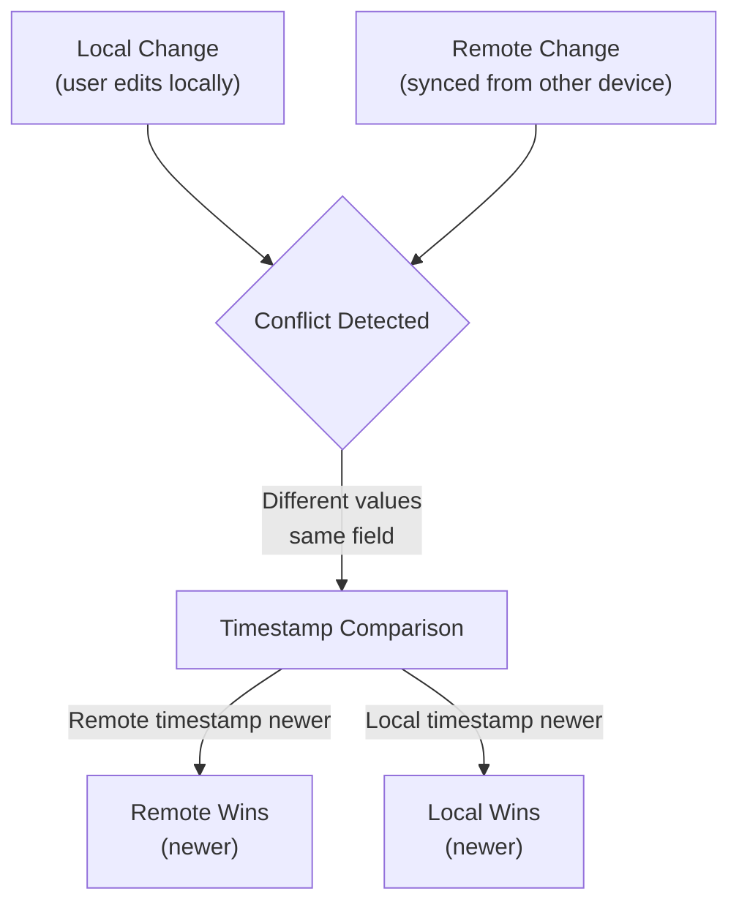

The sync system uses an **Outbox Pattern** on the client and **Changelog Materialization** on the server to keep IndexedDB and your database synchronized.

## Outbox Pattern

When mutations happen locally, they're stored in the outbox before being synced:



This ensures:

- **Offline resilience**: Changes are durable even if network fails
- **Reliable delivery**: Automatic retry until server ACKs
- **Ordering**: Changes are processed in the order they happened

### Outbox Table

The outbox is automatically managed by the generated client. The `$outbox` field is a special helper with dedicated sync methods (not standard Prisma CRUD):

```typescript
interface OutboxEventRecord {
  id: string; // Unique event ID
  entityType: string; // Model name (User, Todo, etc)
  operation: "create" | "update" | "delete";
  payload: any; // The mutation data
  createdAt: Date;
  synced: boolean;
  syncedAt: Date | null;
  lastAttemptedAt: Date | null;
  tries: number;
  lastError: string | null;
  retryable: boolean;
}
```

## Reading Outbox

Get batch of unsynced events:

```typescript
// Get next batch of unsynced events (default limit: 20)
const events = await client.$outbox.getNextBatch({ limit: 20 });

console.log(`${events.length} changes waiting to sync`);
```

Check for retryable events:

```typescript
// Used by sync worker to determine if pull phase should run
const hasRetryable = await client.$outbox.hasAnyRetryableUnsynced();

if (hasRetryable) {
  console.log("Attempting to sync...");
}
```

## Push Results

When the server processes events, it returns which succeeded and which failed:

```typescript
interface PushResult {
  applied: Array<{
    id: string; // Outbox event ID
    model: string;
    keyPath: any[];
    success: true;
  }>;
  errors: Array<{
    id: string;
    model: string;
    keyPath: any[];
    error: string; // Human-readable error
    code: string; // Machine-readable code
    retryable: boolean; // Safe to retry?
  }>;
}
```

### Example Push Response

```json
{
  "applied": [
    {
      "id": "evt-123",
      "model": "User",
      "keyPath": ["user-abc"],
      "success": true
    },
    {
      "id": "evt-124",
      "model": "Todo",
      "keyPath": ["todo-xyz"],
      "success": true
    }
  ],
  "errors": [
    {
      "id": "evt-125",
      "model": "Todo",
      "keyPath": ["todo-def"],
      "error": "User is not authorized to modify this todo",
      "code": "OWNERSHIP_ERROR",
      "retryable": false
    }
  ]
}
```

### Handling Push Results

The sync worker automatically handles results:

```typescript
// Applied events are marked synced, then removed from outbox
// Failed retryable events are retried on next sync
// Failed non-retryable errors are logged for user action

client.syncWorker.on("sync:error", (error) => {
  if (error.code === "OWNERSHIP_ERROR") {
    // User needs to fix permissions on server
    alert("Your changes couldn't be synced. Check permissions.");
  } else if (error.code === "VALIDATION_ERROR") {
    // Invalid data - won't retry
    console.error("Validation error:", error.details);
  } else {
    // Temporary error - will retry automatically
    console.log("Sync will retry...");
  }
});
```

## Pull Results

When pulling, the server returns all changes since the client's cursor:

```typescript
interface PullResponse {
  changelog: Array<{
    id: string; // Changelog entry ID (cursor point)
    model: string;
    operation: "create" | "update" | "delete";
    keyPath: any[];
    scopeKey: string; // User/owner identifier
  }>;
  records: Record<string, any[]>; // Model -> record data
}
```

### Example Pull Response

```json
{
  "changelog": [
    {
      "id": "ch-001",
      "model": "User",
      "operation": "create",
      "keyPath": ["user-abc"],
      "scopeKey": "user-abc"
    },
    {
      "id": "ch-002",
      "model": "Todo",
      "operation": "update",
      "keyPath": ["todo-xyz"],
      "scopeKey": "user-abc"
    },
    {
      "id": "ch-003",
      "model": "Todo",
      "operation": "delete",
      "keyPath": ["todo-old"],
      "scopeKey": "user-abc"
    }
  ],
  "records": {
    "User": [
      {
        "id": "user-abc",
        "name": "Alice",
        "email": "alice@example.com"
      }
    ],
    "Todo": [
      {
        "id": "todo-xyz",
        "title": "Updated Task",
        "userId": "user-abc"
      }
    ]
  }
}
```

### Applying Pull Results

The generated `applyPull` function merges remote changes:

```typescript
import { applyPull } from "$lib/prisma-idb/client";

const result = await applyPull(client._db, pullResponse.changelog, pullResponse.records, versionMetaRecord);

// result.applied: count of applied changes
// result.conflicts: any conflicts detected and resolved
```

## Conflict Resolution

When local and remote changes conflict, the system uses **Last-Writer-Wins (LWW)** by default:



### Conflict Example

```typescript
// Device 1: User updates task title
await client.todo.update({
  where: { id: "todo-1" },
  data: { title: "Buy groceries" }, // timestamp: 10:00
});

// Device 2: Simultaneously updates the same task
// (on server, remote title: "Go to store") // timestamp: 10:05

// When device 1 pulls changes:
// Remote is newer (10:05 > 10:00)
// Local title is overwritten: "Go to store"
```

### Detecting Conflicts

Monitor conflict events:

```typescript
const syncWorker = client.createSyncWorker({
  onConflict: (conflict) => {
    console.log("Conflict detected:", {
      model: conflict.model,
      keyPath: conflict.keyPath,
      local: conflict.local,
      remote: conflict.remote,
      resolution: conflict.resolution, // "local" or "remote"
    });

    // Notify user
    if (conflict.resolution === "remote") {
      alert(`Your changes to ${conflict.model} were overwritten by a remote update.`);
    }
  },
});
```

### Authoritatively-Resolving Conflicts

The `applyPull` logic respects the Authoritatively-resolved Schema DAG:

```prisma
// User owns their own record
model User {
  id String @id
  name String
  todos Todo[]
}

// Todo belongs to User (authority on changes)
model Todo {
  id String @id
  title String
  userId String
  user User @relation(fields: [userId], references: [id])
}
```

**Conflict resolution rules:**

1. **By timestamp** for direct fields (last write wins)
2. **By ownership** for relationships (owner's version takes precedence)
3. **By position in DAG** for complex conflicts

See [Authoritative Schema DAG](./authoritative-schema-dag) for depth.

## Outbox Stats

Monitor pending sync operations:

```typescript
// Get outbox statistics
const stats = await client.$outbox.stats();

console.log(`${stats.unsynced} changes waiting to sync`);
console.log(`${stats.failed} failed changes`);

if (stats.lastError) {
  console.log(`Last error: ${stats.lastError}`);
}
```

### UI Indicator

Show sync status in your app:

```svelte
<script lang="ts">
  let syncStats = $state({ unsynced: 0, failed: 0 });
  let isSyncing = $state(false);

  onMount(async () => {
    const client = await PrismaIDBClient.createClient();
    const syncWorker = client.createSyncWorker({
      /* ... */
    });

    // Check stats periodically or after sync
    const updateStats = async () => {
      syncStats = await client.$outbox.stats();
    };

    syncWorker.on("sync:start", () => {
      isSyncing = true;
    });

    syncWorker.on("sync:complete", async () => {
      await updateStats();
      isSyncing = false;
    });

    await updateStats();
    syncWorker.start();
  });
</script>

{#if isSyncing}
  <div class="sync-indicator">Syncing...</div>
{:else if syncStats.unsynced > 0}
  <div class="sync-warning">{syncStats.unsynced} changes pending</div>
{:else if syncStats.failed > 0}
  <div class="sync-error">{syncStats.failed} changes failed - {syncStats.lastError}</div>
{:else}
  <div class="sync-success">✓ All synced</div>
{/if}
```

## Retry Logic

Failed events are automatically tracked and retried by the sync worker. Each outbox event tracks:

```typescript
interface OutboxEventRecord {
  tries: number; // Retry attempt count
  lastError: string | null; // Error message if failed
  retryable: boolean; // Whether error allows retries
  lastAttemptedAt: Date | null; // Timestamp of last attempt
}
```

Manually mark events as failed:

```typescript
await client.$outbox.markFailed(eventId, {
  type: "OWNERSHIP_ERROR",
  message: "User is not authorized",
  retryable: false, // Non-retryable: won't retry
});
```

Non-retryable errors (like `OWNERSHIP_ERROR`) are logged and require manual intervention. Retryable errors are automatically retried by the sync worker.

Clear old synced events:

```typescript
// Remove synced events older than 7 days
const deletedCount = await client.$outbox.clearSynced({ olderThanDays: 7 });

console.log(`Cleaned up ${deletedCount} old synced events`);
```

## Performance

### Batch Size

Pull uses reasonable batch sizes to avoid overwhelming the database:

```typescript
// pages/api/sync/pull.ts
const changelog = await prisma.changelog.findMany({
  take: 1000, // Reasonable batch size
  orderBy: { id: "asc" },
});
```

Adjust based on your database performance and network speed.

### Cursor Advancement

The sync worker automatically tracks the cursor (last pulled changelog ID):

```typescript
// Stored in versionMeta table
const versionMeta = await client.versionMeta.findUnique({
  where: { id: "current" },
});

console.log(`Last synced changelog: ${versionMeta.pullCursor}`);
```

Only pull changes after the cursor on next sync cycle.

## See Also

- [Sync Worker](./sync-worker) - Configuring sync behavior
- [API Design](./api-design) - Implementing endpoints
- [Schema Requirements](./schema-requirements) - Ownership setup
- [Authoritative Schema DAG](./authoritative-schema-dag) - Conflict resolution details
