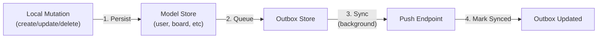

The sync system uses an **Outbox Pattern** on the client to queue mutations reliably and **Changelog Materialization** on the server to track changes.

## Outbox Pattern

When mutations happen locally, they're persisted to IndexedDB immediately, then queued in the outbox for syncing:



This ensures:

- **Durability**: Changes survive app restarts
- **Reliability**: Automatic retry until server ACKs
- **Ordering**: Changes processed in creation order

## Outbox Event Record

The outbox stores events with this structure (defined in [idb-interface.ts](https://github.com/prisma-idb/idb-client-generator/blob/fumadocs/apps/pidb-kanban-example/src/lib/prisma-idb/client/idb-interface.ts#L31)):

```typescript
export interface OutboxEventRecord {
  id: string; // UUID generated by client
  entityType: string; // Model name (Board, Todo, User, etc)
  operation: "create" | "update" | "delete";
  payload: unknown; // The full record data
  createdAt: Date;
  tries: number; // Retry attempt count
  lastError: string | null; // Error message if failed
  synced: boolean; // Whether server has ACK'd
  syncedAt: Date | null; // When marked synced
  lastAttemptedAt: Date | null; // When last sync attempt was made
  retryable: boolean; // Whether to keep retrying
}
```

## Accessing the Outbox

The client exposes the outbox via `client.$outbox`:

```typescript
import { getClient } from "$lib/client";

const client = getClient();

// Get next batch of unsynced events (default limit: 20)
const events = await client.$outbox.getNextBatch({ limit: 50 });
console.log(`Found ${events.length} unsynced events`);

// Check if any retryable unsynced events exist
const hasEvents = await client.$outbox.hasAnyRetryableUnsynced();
if (hasEvents) {
  console.log("Ready to sync");
}

// Get statistics
const stats = await client.$outbox.stats();
console.log(`Unsynced: ${stats.unsynced}, Failed: ${stats.failed}`);
```

These methods are called automatically by the sync worker. See [Step 5: Sync Worker](./step-5-sync-worker) to configure sync behavior.

## Sync Worker Results

After push and pull operations complete, the sync worker processes results. The sync worker is configured with handlers for push and pull responses:

```typescript
export class TodosState {
  syncWorker = getClient().createSyncWorker({
    push: {
      handler: async (events) => {
        // Send events to server, get back array of PushResult
        return await fetch("/api/sync/push", {
          method: "POST",
          body: JSON.stringify({ events }),
        }).then((r) => r.json());
      },
    },
    pull: {
      handler: async (cursor) => {
        // Fetch changes since cursor
        return await fetch("/api/sync/pull", {
          method: "POST",
          body: JSON.stringify({ lastChangelogId: cursor }),
        }).then((r) => r.json());
      },
    },
  });
}
```

### Push Results

The server returns a `PushResult[]` for each event. See [applyPush](./api-design) for the actual result structure:

```typescript
export interface PushResult {
  id: string; // Event ID from outbox
  appliedChangelogId: string | null; // Changelog entry ID if successful
  error: null | {
    type: keyof typeof PushErrorTypes;
    message: string;
    retryable: boolean;
  };
}
```

The sync worker automatically:

- Marks successful events synced with `client.$outbox.markSynced(appliedLogs)`
- Updates failed events with `client.$outbox.markFailed(eventId, error)`
- Retries events marked `retryable: true`
- Logs non-retryable errors for user action

### Pull Results

Pull returns changelog entries with materialized records:

```typescript
interface PullResponse {
  cursor: string; // Last changelog ID for next pull
  logsWithRecords: Array<{
    id: string; // Changelog entry ID
    model: string; // Model name
    operation: "create" | "update" | "delete";
    keyPath: Array<string | number>;
    record?: any; // The actual data (null for deletes)
    changelogId: string;
  }>;
}
```

The sync worker applies these changes to IndexedDB automatically via `client.applyPull(logsWithRecords)`.

## Outbox Methods

The generated outbox class has these methods:

### create()

Create an outbox event (called automatically by mutations when outbox sync is enabled):

```typescript
const event = await client.$outbox.create(
  {
    data: {
      entityType: "Board",
      operation: "create",
      payload: { id: "board-1", name: "New Board", userId: "user-1" },
    },
  },
  { tx: transaction, silent: true }
);
```

### getNextBatch()

Fetch unsynced, retryable events in creation order:

```typescript
const batch = await client.$outbox.getNextBatch({ limit: 50 });
```

Returns up to `limit` events, sorted by `createdAt`.

### hasAnyRetryableUnsynced()

Check if sync work is needed (gates the pull phase):

```typescript
if (await client.$outbox.hasAnyRetryableUnsynced()) {
  console.log("Events waiting to sync");
}
```

### markSynced()

Mark events as successfully synced. Called by sync worker with results from `applyPush`:

```typescript
await client.$outbox.markSynced([
  { id: "evt-1", lastAppliedChangeId: "ch-123" },
  { id: "evt-2", lastAppliedChangeId: "ch-124" },
]);
```

### markFailed()

Mark event as failed. Called by sync worker when `applyPush` returns an error:

```typescript
await client.$outbox.markFailed("evt-1", {
  type: "SCOPE_VIOLATION",
  message: "User is not authorized to modify this board",
  retryable: false,
});
```

Non-retryable errors require manual intervention (user must fix permissions, etc). Retryable errors are automatically attempted again.

### stats()

Get outbox statistics:

```typescript
const { unsynced, failed, lastError } = await client.$outbox.stats();
```

Returns counts of unsynced and failed events, plus the most recent error message.

### clearSynced()

Remove old synced events to keep storage clean:

```typescript
// Delete synced events older than 7 days
const deleted = await client.$outbox.clearSynced({ olderThanDays: 7 });
console.log(`Cleaned up ${deleted} old events`);
```

## Real Example

From [pidb-kanban-example/test/demo.test.ts](https://github.com/prisma-idb/idb-client-generator/blob/fumadocs/apps/pidb-kanban-example/test/demo.test.ts#L1):

```typescript
test("syncs_create_update_delete_across_devices", async ({ pages }) => {
  const [pageA, pageB] = pages;

  // Device A: Create and update a board
  await pageA.getByTestId("create-board-button").click();
  await pageA.getByTestId("rename-board-input").fill("Project Alpha");
  await pageA.getByTestId("rename-board-submit").click();

  // Device A: Trigger sync
  await Promise.all([
    pageA.getByTestId("sync-now-button").click(),
    pageA.waitForResponse((resp) => resp.url().includes("/sync/pull")),
  ]);

  // Device B: Sync and verify board appears
  await pageB.getByTestId("sync-now-button").click();
  await expect(pageB.getByText("Project Alpha")).toBeVisible();

  // Device A: Delete the board
  await pageA.getByTestId("delete-board-button").click();

  // Device A: Sync deletion
  await pageA.getByTestId("sync-now-button").click();

  // Device B: Pull deletion
  await pageB.getByTestId("sync-now-button").click();
  await expect(pageB.getByText("Project Alpha")).not.toBeVisible();
});
```

## Error Handling

Non-retryable errors indicate problems that won't go away automatically:

```typescript
export const PushErrorTypes = {
  INVALID_MODEL: "INVALID_MODEL", // Unknown model name
  RECORD_VALIDATION_FAILURE: "RECORD_VALIDATION_FAILURE", // Data doesn't match schema
  MISSING_PARENT: "MISSING_PARENT", // Foreign key target missing
  SCOPE_VIOLATION: "SCOPE_VIOLATION", // User lacks permission
  UNKNOWN_OPERATION: "UNKNOWN_OPERATION", // Not create/update/delete
  UNKNOWN_ERROR: "UNKNOWN_ERROR", // Server error
  MAX_RETRIES: "MAX_RETRIES", // Exceeded retry limit
  CUSTOM_VALIDATION_FAILED: "CUSTOM_VALIDATION_FAILED", // Custom validation rejected
};
```

The sync worker emits events you can listen to:

```typescript
client.syncWorker.on("pushcompleted", (result) => {
  console.log("Push complete:", result);
});

client.syncWorker.on("pullcompleted", (result) => {
  console.log("Pull complete:", result);
});

client.syncWorker.on("statuschange", (status) => {
  console.log("Sync status:", status);
});
```

See [Step 5: Sync Worker](./step-5-sync-worker) for full configuration options.
