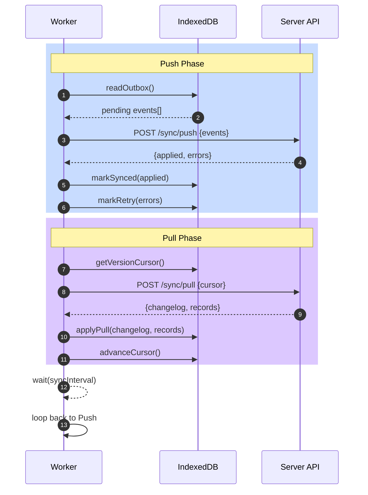

The Sync Worker orchestrates bidirectional synchronization between your IndexedDB and server. It runs periodically, pushing local changes and pulling remote updates.

## Initialization

The sync worker is optional and only created when you enable `outboxSync` in your generator config:

```prisma
generator prismaIDBrowser {
  provider   = "idb-client-generator"
  output     = "../generated"
  outboxSync = true      # Enable sync worker
  rootModel  = "User"
}
```

Initialize the sync worker in your app:

```typescript
import { PrismaIDBClient } from "$lib/prisma-idb";

const client = await PrismaIDBClient.createClient();

// Create the sync worker
const syncWorker = client.createSyncWorker({
  apiUrl: "https://api.example.com",
  push: async (events) => {
    // Send to server
    const response = await fetch(`${apiUrl}/sync/push`, {
      method: "POST",
      body: JSON.stringify({ events }),
    });
    return response.json();
  },
  pull: async (cursor) => {
    // Fetch from server
    const response = await fetch(`${apiUrl}/sync/pull`, {
      method: "POST",
      body: JSON.stringify({ cursor }),
    });
    return response.json();
  },
});

// Start syncing
syncWorker.start();
```

## Configuration

Configure the sync worker behavior:

```typescript
const syncWorker = client.createSyncWorker({
  // API endpoints
  apiUrl: "https://api.example.com",
  push: async (events) => { /* ... */ },
  pull: async (cursor) => { /* ... */ },

  // Timing
  syncInterval: 5000, // ms between sync cycles (default: 5s)
  maxRetries: 3, // max push retries (default: 3)
  retryDelay: 1000, // ms between retries (default: 1s)

  // Behavior
  onError: (error) => {
    console.error("Sync error:", error);
  },
  onSyncStart: () => {
    console.log("Sync started");
  },
  onSyncEnd: () => {
    console.log("Sync completed");
  },
});
```

<Callout type="info">
  **Default Sync Interval**: The worker syncs every 5 seconds. Adjust based on your latency and data freshness needs.
</Callout>

## Lifecycle

### Starting the Worker

```typescript
// Start in the background
syncWorker.start();

// Runs indefinitely until stopped, respecting syncInterval
```

### Manual Sync Cycles

Trigger sync on demand:

```typescript
// Sync immediately without waiting for interval
await syncWorker.sync();

// Useful when:
// - User takes action requiring latest data
// - Network becomes available after offline
// - High-priority updates detected
```

### Stopping the Worker

```typescript
// Stop background sync
syncWorker.stop();

// Waits for current cycle to complete
// Outstanding changes remain in outbox
```

### Status and Monitoring

```typescript
// Check if currently syncing
const isSyncing = syncWorker.isSyncing();

// Get sync state
const state = syncWorker.getState();
console.log({
  isSyncing: state.isSyncing,
  lastSyncTime: state.lastSyncTime,
  nextSyncTime: state.nextSyncTime,
  pendingChanges: state.pendingChanges,
});
```

## Events

The sync worker emits events for reactive UI updates:

```typescript
syncWorker.on("sync:start", () => {
  console.log("Sync cycle beginning");
  // Show loading indicator
});

syncWorker.on("sync:progress", (progress) => {
  console.log(`Syncing: ${progress.pushed}/${progress.total} changes`);
  // Update progress bar
});

syncWorker.on("sync:complete", (result) => {
  console.log("Sync successful", result);
  // Hide loading, refresh UI
});

syncWorker.on("sync:error", (error) => {
  console.error("Sync failed:", error);
  // Show error message, suggest user action
});

syncWorker.on("conflict", (conflict) => {
  console.log("Conflict detected:", conflict);
  // Handle merge conflict
});
```

### Real-Time UI Updates

Use events for reactive components:

```svelte
<script lang="ts">
  import { onMount } from "svelte";
  
  let syncWorker;
  let isSyncing = $state(false);
  let lastSync = $state<Date>();
  let error = $state("");
  
  onMount(async () => {
    const client = await PrismaIDBClient.createClient();
    syncWorker = client.createSyncWorker({ /* ... */ });
    
    syncWorker.on("sync:start", () => {
      isSyncing = true;
      error = "";
    });
    
    syncWorker.on("sync:complete", () => {
      isSyncing = false;
      lastSync = new Date();
    });
    
    syncWorker.on("sync:error", (err) => {
      isSyncing = false;
      error = err.message;
    });
    
    syncWorker.start();
  });
</script>

<div class="sync-status">
  {#if isSyncing}
    <span>Syncing...</span>
  {:else if error}
    <span class="error">{error}</span>
  {:else}
    <span>Last synced: {lastSync?.toLocaleString()}</span>
  {/if}
</div>
```

## Offline Behavior

The sync worker handles offline periods gracefully:

```typescript
syncWorker.on("offline", () => {
  console.log("Network unavailable, will retry when back online");
});

syncWorker.on("online", async () => {
  console.log("Network restored, syncing now");
  await syncWorker.sync(); // Immediate sync after reconnection
});
```

All local mutations are queued in the outbox and synced when the network returns:

```typescript
// User offline, making changes
const user = await client.user.create({
  data: { name: "Alice" },
});
console.log("Queued for sync");

// Network returns, worker detects and syncs
// Changes are pushed to server automatically
```

## Error Handling

The sync worker includes retry logic for transient failures:

```typescript
const syncWorker = client.createSyncWorker({
  maxRetries: 5,
  retryDelay: 2000,
  
  onError: (error) => {
    if (error.code === "NETWORK_ERROR") {
      // Temporary network issue, will retry
      console.log("Network error, retrying...");
    } else if (error.code === "CONFLICT") {
      // Conflict resolution needed
      console.log("Conflict detected:", error.detail);
    } else if (error.code === "UNAUTHORIZED") {
      // Auth failed, user needs to reauthenticate
      window.location.href = "/login";
    }
  },
});
```

## Sync Cycle Flow



## Connection Configuration

### Custom API Implementation

Implement push and pull handlers for your specific API:

```typescript
const syncWorker = client.createSyncWorker({
  push: async (events) => {
    const response = await fetch("/api/sync/push", {
      method: "POST",
      headers: {
        "Content-Type": "application/json",
        "Authorization": `Bearer ${getToken()}`,
      },
      body: JSON.stringify({
        events,
        userId: getCurrentUserId(),
      }),
    });

    if (!response.ok) {
      throw new Error(`Push failed: ${response.statusText}`);
    }

    return response.json();
  },

  pull: async (cursor) => {
    const response = await fetch("/api/sync/pull", {
      method: "POST",
      headers: {
        "Content-Type": "application/json",
        "Authorization": `Bearer ${getToken()}`,
      },
      body: JSON.stringify({
        cursor,
        userId: getCurrentUserId(),
      }),
    });

    if (!response.ok) {
      throw new Error(`Pull failed: ${response.statusText}`);
    }

    return response.json();
  },
});
```

### Batching and Throttling

Control push batch sizes:

```typescript
const syncWorker = client.createSyncWorker({
  push: async (events) => {
    // Process in batches to respect server limits
    const batchSize = 100;
    const results = [];

    for (let i = 0; i < events.length; i += batchSize) {
      const batch = events.slice(i, i + batchSize);
      const result = await fetch("/api/sync/push", {
        method: "POST",
        body: JSON.stringify({ events: batch }),
      }).then((r) => r.json());

      results.push(...result.applied);
    }

    return { applied: results };
  },
});
```

## See Also

- [Outbox Pattern](./outbox) - How mutations are queued
- [Push & Pull Results](./push-pull) - API response formats
- [Validation & Schemas](./validation) - Validating sync data
- [Conflict Resolution](./conflict-resolution) - Handling concurrent changes
