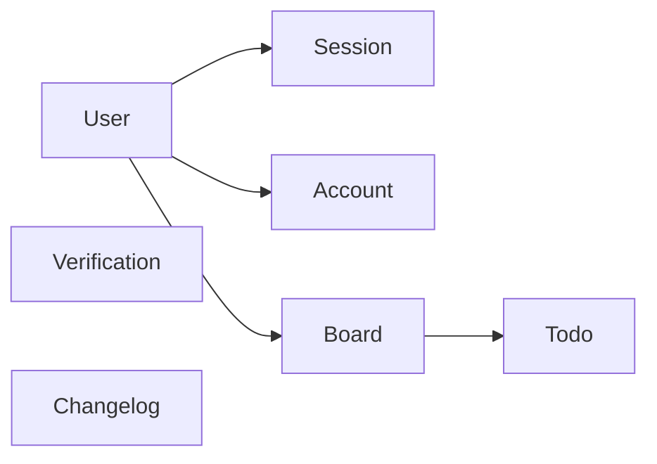
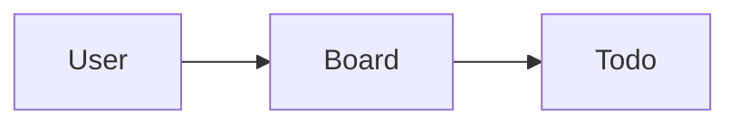
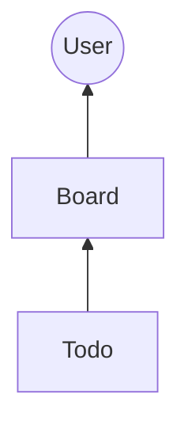
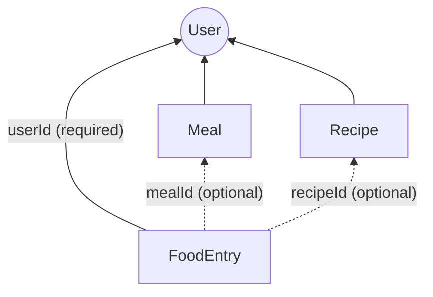

## Authoritative Schema DAG

The authoritative schema DAG (Directed Acyclic Graph) defines how local changes are scoped and applied, ensuring data consistency across clients and the server. This structure manages dependencies between models during synchronization.

### Scoping Schema

Typically in a local-first application, we don't need all the tables/models to be synchronized for every user. Instead, we scope the sync to only the relevant data for each user. This is achieved by excluding/including specific models in the sync process based on user context.

For example, the `Session` model may not be synchronized for every user, as sessions are often user-specific and transient. By scoping the sync to only include models like `User`, `Post`, and `Comment`, in a blog application, we can optimize the synchronization process and reduce unnecessary data transfer.

#### Full schema



#### Scoped schema

Exclude `Session`, `Verification`, `Account`, and `Changelog` models from sync as they aren't relevant to the local intent of the user.



### Creating the DAG

Good news is, you as a developer, don't have to manually create and manage the DAG. You only need to specify the `rootModel` and the models to include in the sync process when initializing the sync engine. The sync engine will automatically construct the DAG based on the relationships defined in your Prisma schema.

For the above example, if `User` is the `rootModel`, and we include `Board` and `Todo` models, the sync engine will understand that `Board` depends on `User`, and `Todo` depends on `Board`, forming the necessary DAG for synchronization.



#### Schema requirements for the DAG

In order to effectively build and utilize the authoritative schema DAG, certain schema requirements must be met. These include defining clear relationships between models, ensuring that foreign keys are properly set up, adhering to the sync schema requirements outlined in the [previous section](./schema-requirements), and the following:

- **Root Model**: The `rootModel` must be clearly defined and should represent the primary entity from which other models derive their context.
- **Dependent Models**: All models that are included in the sync process must have a direct or indirect relationship with the `rootModel`.
- **Ownership Invariants**: Models should include ownership fields (e.g., `ownerId`) to enforce data access rules during synchronization.
- **No Cyclic Dependencies**: The relationships between models must not form cycles, as this would violate the acyclic nature of the DAG.

### Optional Relations in the Ownership Path

A model's ownership path is the chain of foreign keys traced from that model back to the `rootModel` through the DAG. The sync engine uses this path to verify that every record belongs to the authenticated user's scope.

#### Multiple Ownership Paths

When a model has **multiple** relations that eventually reach the `rootModel`, the sync engine considers **all** of them. A record is authorized if **any** path successfully resolves to the authenticated scope — it only rejects when no path can be verified.

Paths are tried shortest-first, and required (non-nullable) relations are preferred within the same length. For optional paths, the engine skips them when their FK is `null` rather than rejecting outright.

For example, given this schema:

```prisma
model User {
  id      String      @id @default(cuid())
  meals   Meal[]
  recipes Recipe[]
  entries FoodEntry[]
}

model Meal {
  id          String      @id @default(cuid())
  userId      String
  user        User        @relation(fields: [userId], references: [id])
  foodEntries FoodEntry[]
}

model Recipe {
  id          String      @id @default(cuid())
  userId      String
  user        User        @relation(fields: [userId], references: [id])
  foodEntries FoodEntry[]
}

model FoodEntry {
  id       String  @id @default(cuid())
  userId   String
  user     User    @relation(fields: [userId], references: [id])
  mealId   String?
  meal     Meal?   @relation(fields: [mealId], references: [id])
  recipeId String?
  recipe   Recipe? @relation(fields: [recipeId], references: [id])
}
```

`FoodEntry` has three paths to `User`:



A `FoodEntry` with `mealId: null` and `recipeId: null` is **allowed** — because the required `userId` path alone is sufficient to verify ownership. The engine only rejects the record if **all** paths fail (e.g., `userId` points to a different user, and both optional FKs are null).

#### Single Ownership Path (Optional)

If a model has only **one** path to the `rootModel` and that path goes through an optional relation, the sync engine will **reject** any create, update, or resurrection where the FK is `null`. A `null` FK on the sole ownership path would break the chain to the root model, making scope verification impossible — so the engine throws a `SCOPE_VIOLATION` error instead of silently allowing a detached record.

<Callout title="Only ownership paths are enforced">
  These restrictions apply **only** to relations on ownership paths to the `rootModel`. Optional relations to other
  models that are not part of any ownership path are completely unaffected — they can be `null` without issue.
</Callout>

For example, given this schema where `FoodEntry` has a **single** optional ownership path:

```prisma
model User {
  id    String  @id @default(cuid())
  meals Meal[]
}

model Meal {
  id          String      @id @default(cuid())
  userId      String
  user        User        @relation(fields: [userId], references: [id])
  foodEntries FoodEntry[]
}

model FoodEntry {
  id     String  @id @default(cuid())
  mealId String?
  meal   Meal?   @relation(fields: [mealId], references: [id])
}
```

The only ownership path for `FoodEntry` is `FoodEntry → Meal → User`. Since the `mealId` foreign key is nullable and there is no alternative path, attempting to sync a `FoodEntry` with `mealId: null` will be rejected with a `SCOPE_VIOLATION` error.
