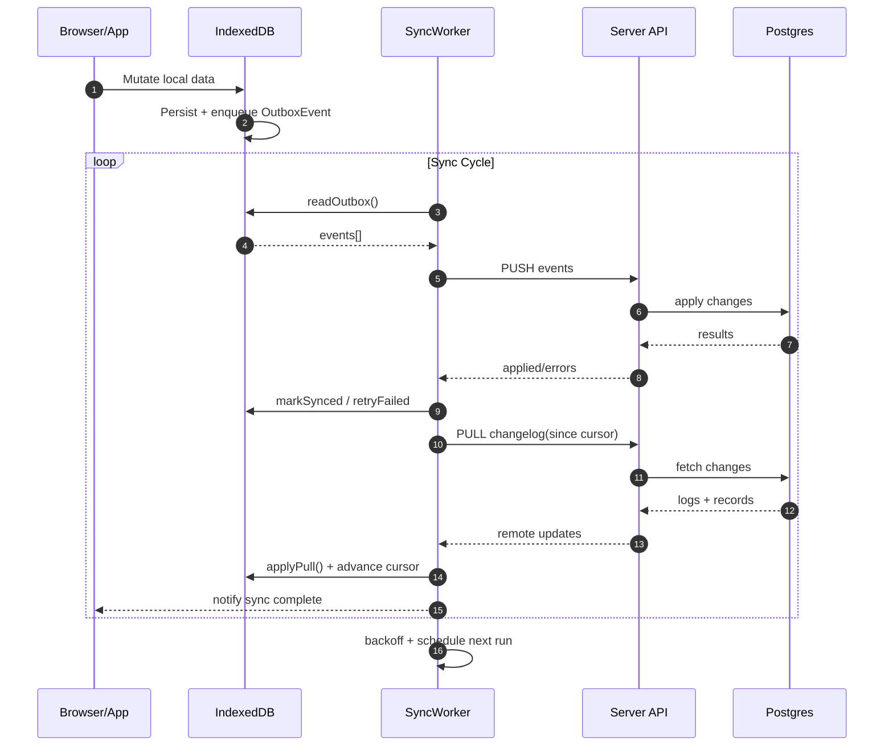

## Prisma IDB Sync Engine

The Prisma IDB Sync Engine is an optional component that enables bidirectional synchronization between the local IndexedDB database and a remote server. It is designed to ensure data consistency across multiple devices while providing robust conflict resolution and authorization mechanisms.

### The Core Components

- **Sync Worker**: Manages push and pull operations, ensuring local changes are sent to the server and remote changes are applied locally.
- **Outbox**: Stores local mutations awaiting server synchronization.
- **Version Table**: Tracks local database state relative to the server, determining what changes to pull.
- **Changelog Table**: Records server-side changes that are materialized into IndexedDB during pull operations.

### Synchronization Process

